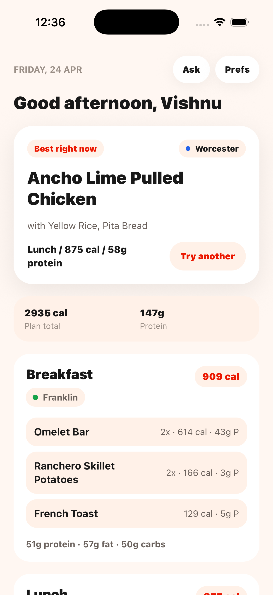
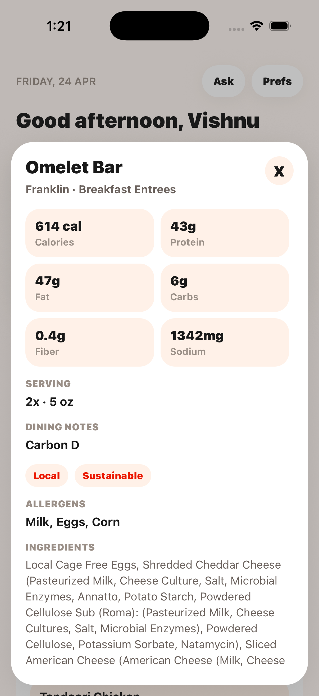
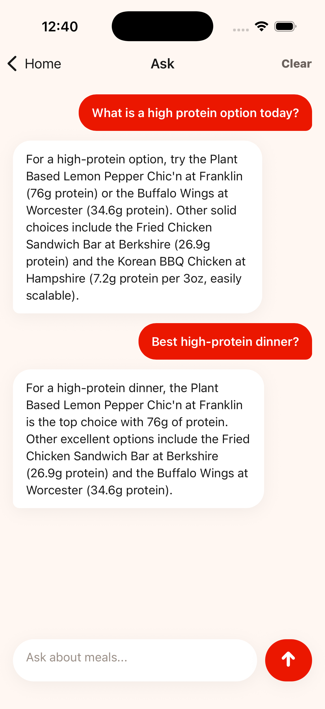
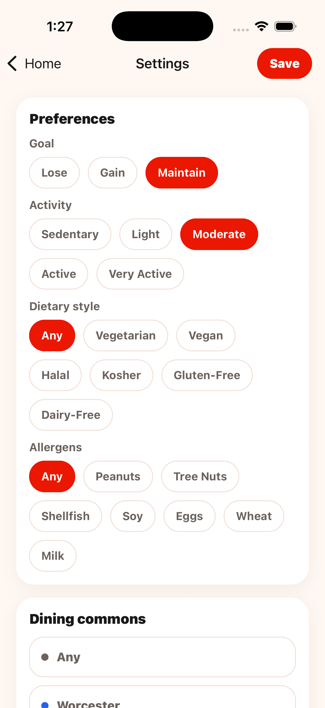

# UMass Meal Planner

UMass Meal Planner is a mobile app for UMass Amherst students that recommends what to eat from the dining halls each day.

The app uses the live UMass Dining menu, the student's profile, and Gemini to generate a practical daily meal plan. It is recommendation-only: there is no food logging, no streaks, no social layer, and no tracking what the user actually ate.

## App Idea

UMass dining menus are large and change every day. This app turns that menu into a simple daily plan:

- Sign in with a UMass email.
- Enter body stats, goal, dietary restrictions, allergens, and dining preferences.
- Get a breakfast, lunch, and dinner plan using current UMass Dining items.
- Regenerate the plan when needed.
- Ask chat questions about today's dining hall menu.

The goal is a fast utility app: open it, see what to eat, and move on.

## What It Does

- Scrapes Worcester, Franklin, Hampshire, and Berkshire menus.
- Stores normalized menu items, nutrition facts, allergens, dietary tags, and ingredients in Supabase.
- Generates one cached meal plan per user per day.
- Uses Gemini server-side so API keys never ship in the mobile app.
- Provides menu-aware chat using the user's profile and today's menus.
- Gates access to `@umass.edu` accounts.

## High-Level Architecture

```text
UMass Dining AJAX API
        |
        v
Python scraper
GitHub Actions daily cron
        |
        v
Supabase Postgres
menu_items, profiles, meal_plans, chat_messages
        |
        +-------------------+
        |                   |
        v                   v
Expo React Native app   Supabase Edge Functions
                         generate-meal-plan, chat
                              |
                              v
                         Gemini API
```

### Data Flow

1. GitHub Actions runs the Python scraper every morning.
2. The scraper fetches today plus the next 6 days for all four dining commons.
3. Parsed menu rows are upserted into Supabase `menu_items`.
4. The mobile app signs the user in through Supabase Auth and stores tokens in Secure Store.
5. Home checks for today's cached `meal_plans` row.
6. If no valid plan exists, the app calls the `generate-meal-plan` Edge Function.
7. The Edge Function loads the user's profile and today's menu, calls Gemini, validates structured JSON, stores the result, and returns it to the app.
8. Chat calls the `chat` Edge Function, which loads recent chat history, today's menu, and the profile before calling Gemini.

## UI

The UI is warm, minimal, and utility-focused. It uses a cream background, white rounded cards, sparse copy, and DoorDash-like red primary actions. There are no custom fonts, no dark mode, no gamification, and no social features. The current navigation uses React Navigation native stacks.

### Screens

| Screen | Purpose |
|--------|---------|
| Sign In | Google sign-in through Supabase Auth. Only `@umass.edu` accounts are allowed. |
| Body Stats | First onboarding step. Collects height, weight, age, and gender. |
| Goals | Second onboarding step. Collects goal and activity level, then calculates calorie and macro targets. |
| Preferences | Final onboarding step. Collects dietary restrictions, allergens, dining commons preferences, and free-text preferences. |
| Home | Main daily plan screen. Shows today's recommendation, a lightweight calories/protein summary, meal cards, Chat/Prefs buttons, and secondary Regenerate. |
| Food Details | Tap-open card from a meal item. Shows station, serving size, detailed nutrition, tags, allergens, carbon rating, and ingredients without cluttering Home. |
| Chat | Menu-aware nutrition chat. Sends short questions to the Edge Function and persists chat history. |
| Settings | Edits meal preferences first, then body/account details, recalculates targets when needed, and signs out. |

### Simulator Screens

Current iPhone simulator screenshots:

| Home | Food Details | Chat | Settings |
|------|--------------|------|----------|
|  |  |  |  |

### Main Components

- `MealCard`: renders one meal period with only the essentials visible; tapping an item opens the detail card.
- `ChatBubble`: renders user and assistant messages.
- `OnboardingProgress`: shows progress across the three onboarding screens.

## Backend

Supabase owns authentication, database storage, row-level security, and Edge Functions.

Core tables:

- `menu_items`: daily scraped menu items, station, nutrition data, dietary tags, allergens, ingredients, carbon rating, and dining metadata.
- `dining_commons_metadata`: dining hall hours, special hours, address, payment methods, and livestream links scraped from UMass location pages.
- `profiles`: user onboarding profile and targets.
- `meal_plans`: cached daily Gemini-generated plans.
- `chat_messages`: persisted chat history.

Edge Functions:

- `generate-meal-plan`: authenticated daily meal-plan generation.
- `chat`: authenticated menu-aware chat.

Gemini calls use the `gemini-flash-latest` model alias with structured JSON schemas. Flash thinking is disabled for these JSON calls with `thinkingBudget: 0` so the output budget is reserved for the app response.

## Scraper Automation

The scheduled automation is a GitHub Actions workflow, not a scheduled Edge Function. It runs Python because the scraper reuses the existing local parser and UMass Dining AJAX fetch logic.

```text
.github/workflows/scrape.yml
```

Current workflow behavior:

- Runs daily at `0 10 * * *` UTC.
- Can also be run manually with `workflow_dispatch`.
- Scrapes all four dining commons.
- Uploads today plus the next 6 days.
- Uses GitHub repo secrets `SUPABASE_URL` and `SUPABASE_SERVICE_ROLE_KEY`.

## Backend Deployment

Supabase backend deployment is handled by:

```text
.github/workflows/deploy-supabase.yml
```

The workflow validates Python and mobile code, pushes Supabase migrations, deploys `generate-meal-plan` and `chat`, then smoke-tests that both functions are reachable and still protected by JWT auth.

Required GitHub repo secrets:

```bash
SUPABASE_ACCESS_TOKEN   # Supabase account access token for CLI deploys
SUPABASE_DB_PASSWORD    # Project database password, not the service-role key
```

It can be run manually with `workflow_dispatch` and also runs on pushes to `main` that change `supabase/functions/**` or `supabase/migrations/**`.

## Frontend Deployment

Expo web deployment is handled by:

```text
.github/workflows/deploy-frontend.yml
```

The workflow installs the mobile dependencies, typechecks the app, exports the Expo web build, adds a Cloudflare Pages SPA fallback for routes like `/auth/callback`, and deploys `mobile/dist` to the Cloudflare Pages project `umeal`.

Required GitHub repo secrets:

```bash
CLOUDFLARE_API_TOKEN
CLOUDFLARE_ACCOUNT_ID
EXPO_PUBLIC_SUPABASE_URL
EXPO_PUBLIC_SUPABASE_ANON_KEY
```

It can be run manually with `workflow_dispatch` and also runs on pushes to `main` that change `mobile/**`.

## Repo Layout

```text
scraper/                  Python UMass Dining scraper
supabase/migrations/      Postgres schema and RLS
supabase/functions/       Deno Edge Functions
mobile/                   Expo React Native app
.github/workflows/        Daily scraper workflow
```

## Environment

Root `.env` for scraper uploads:

```bash
SUPABASE_URL=https://your-project.supabase.co
SUPABASE_SERVICE_ROLE_KEY=your-service-role-key
```

`mobile/.env` for Expo:

```bash
EXPO_PUBLIC_SUPABASE_URL=https://your-project.supabase.co
EXPO_PUBLIC_SUPABASE_ANON_KEY=your-anon-key
```

Supabase Edge Function secrets:

```bash
GEMINI_API_KEY=your-gemini-api-key
SUPABASE_SERVICE_ROLE_KEY=your-service-role-key
```

## Local Development

Install Python dependencies:

```bash
python3 -m pip install -r requirements.txt
```

Install mobile dependencies:

```bash
cd mobile
npm install
```

Start Expo:

```bash
npm run start
```

Run the scraper locally:

```bash
python3 -m scraper.auto_scrape --all-commons --start-date "$(TZ=America/New_York date +%F)" --days 7 --upload-supabase
```

Deploy Supabase functions:

```bash
npx supabase@latest functions deploy generate-meal-plan --project-ref thaoylgvgsvbouyirdfg --use-api
npx supabase@latest functions deploy chat --project-ref thaoylgvgsvbouyirdfg --use-api
```

## Validation

Current checks:

```bash
python3 -m pytest tests/ -v
python3 -m compileall scraper
cd mobile && npm run typecheck
python3 -m scraper.auto_scrape --test --day 2026-04-24 --all-commons --request-delay 0
```
